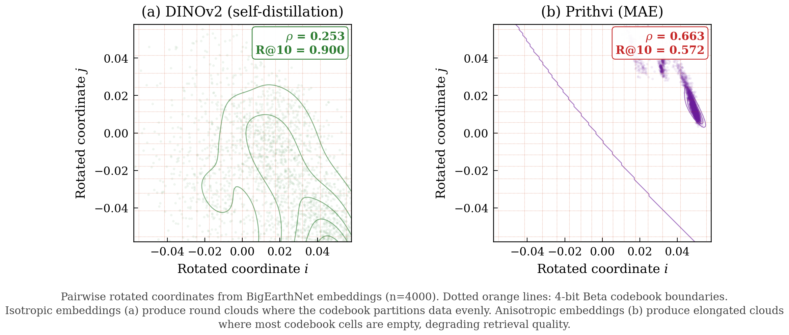
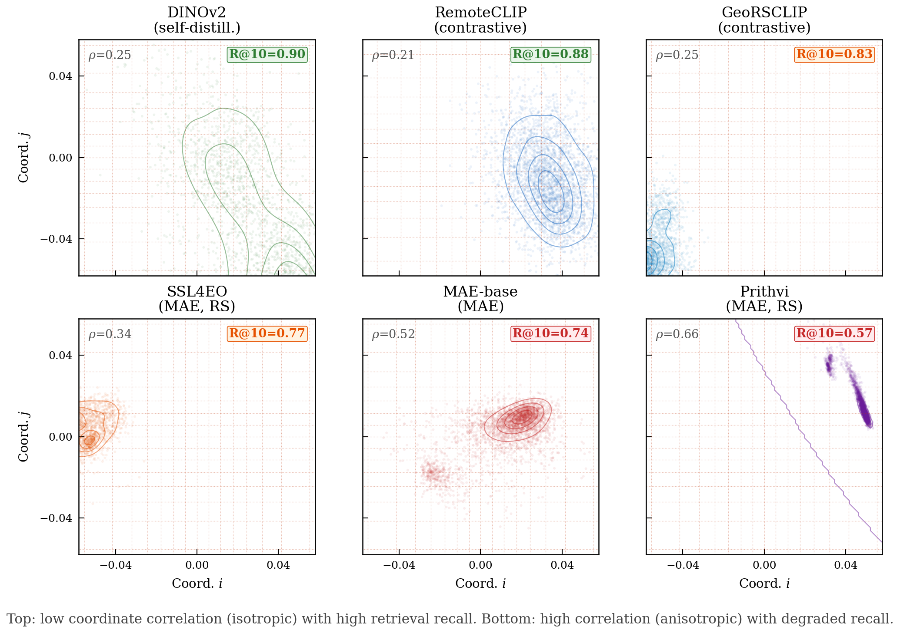
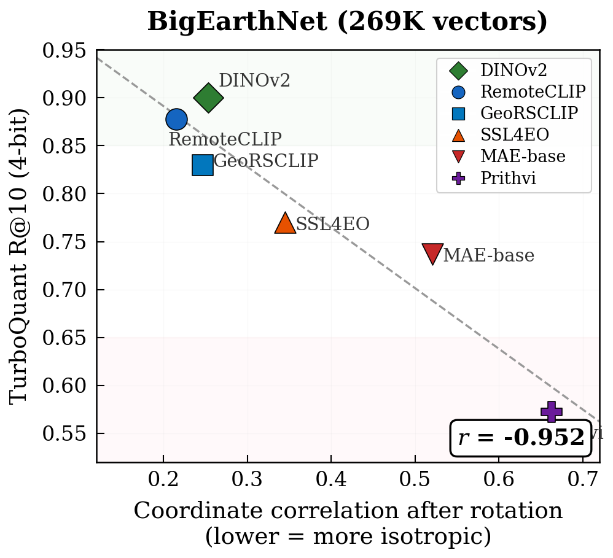
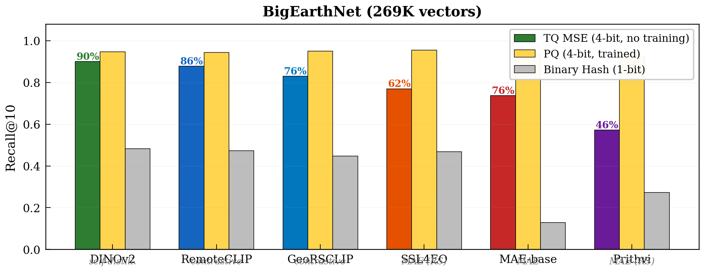
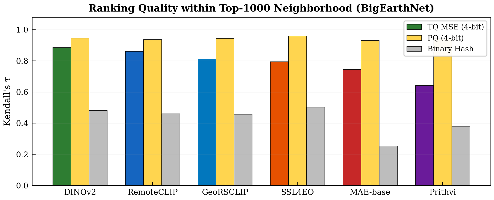
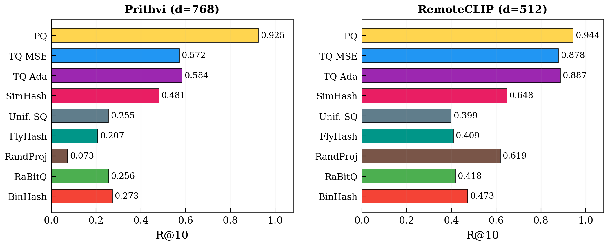
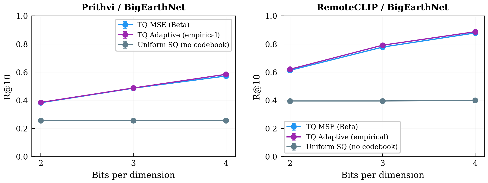
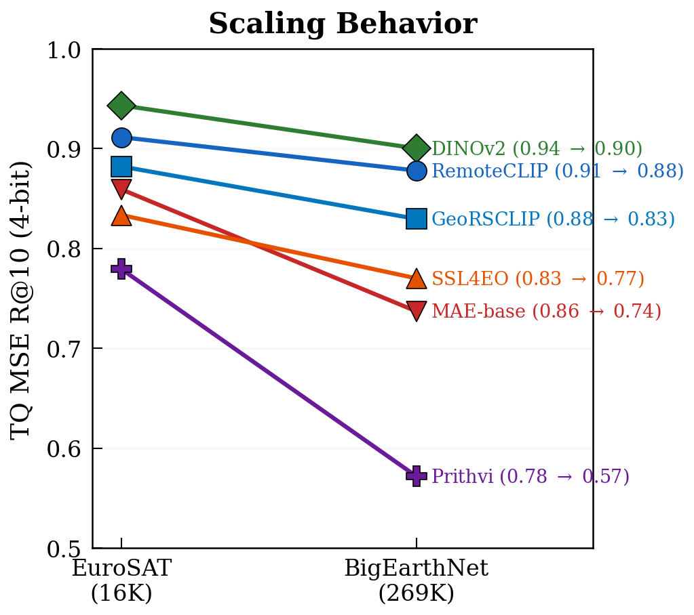
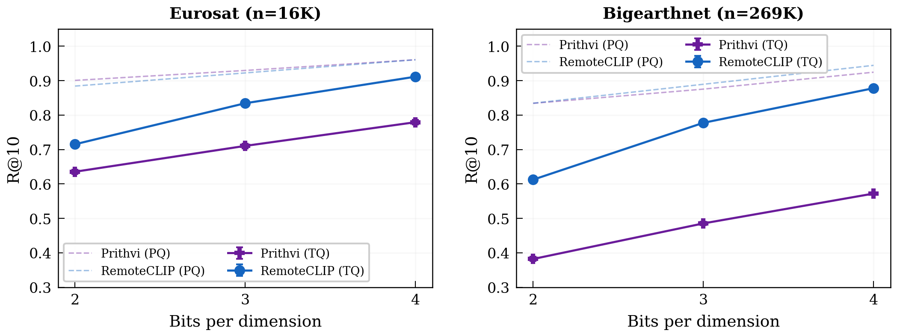

# 4. Results

## 4.1 Embedding Isotropy Varies by Training Objective

Before evaluating quantization, we measure the geometry of each model's embeddings. We apply a random orthogonal rotation and compute coordinate correlation (mean absolute pairwise Pearson correlation across 50 coordinate pairs) and KS D statistic (fit to the theoretical Beta distribution).

**Table 1: Embedding isotropy by model (BigEarthNet)**

| Model | Training | d | Coord Corr ($\rho$) | KS D |
|-------|----------|---|:----:|:----:|
| RemoteCLIP | Contrastive (CLIP) | 512 | 0.215 | 0.551 |
| GeoRSCLIP | Contrastive (CLIP) | 768 | 0.247 | 0.849 |
| DINOv2 | Self-distillation | 768 | 0.253 | 0.450 |
| SSL4EO | MAE (RS) | 768 | 0.345 | 0.846 |
| MAE-base | MAE (ImageNet) | 768 | 0.521 | 0.360 |
| Prithvi | MAE (RS) | 768 | 0.663 | 0.730 |

The three contrastive/self-distillation models all have coordinate correlation below 0.26. The three MAE models all have correlation above 0.34. This matches the theoretical expectation: contrastive and self-distillation losses push embeddings toward uniform distribution on the sphere (Wang & Isola, 2020), while MAE reconstruction has no such pressure.

The KS D statistic does not cleanly separate the groups. MAE-base has the lowest KS D (0.360) despite being an MAE model. Coordinate correlation is a more direct measure of coordinate independence, which is the property TurboQuant relies on.

Figure 1 visualizes this difference. DINOv2 embeddings produce a round, symmetric scatter cloud after rotation. Prithvi embeddings produce an elongated diagonal ellipse. The same quantization grid (orange dotted lines) partitions the round cloud evenly but wastes most cells on the elongated cloud.

*Figure 1: Pairwise rotated coordinates from BigEarthNet embeddings. Left: DINOv2 (isotropic, round cloud). Right: Prithvi (anisotropic, elongated cloud). Orange dotted lines show 4-bit Beta codebook boundaries. The same codebook works well for round clouds but poorly for elongated ones.*

Figure 2 extends this to all six models. The top row (low correlation) shows round or near-round distributions. The bottom row (high correlation) shows progressively elongated distributions.

*Figure 2: Rotated coordinate distributions for all six models. Top row: contrastive/self-distillation (isotropic, high R@10). Bottom row: MAE (anisotropic, lower R@10).*

## 4.2 Quantization Recall Depends on Isotropy

Table 2 presents the main result: TurboQuant MSE Recall@10 at 4 bits across all 6 models and both datasets.

**Table 2a: EuroSAT (16K vectors), TQ MSE 4-bit R@10**

| Model | Training | $\rho$ | TQ MSE | PQ | BinHash | Gap Closed |
|-------|----------|:----:|:----:|:----:|:----:|:----:|
| DINOv2 | Self-distillation | 0.132 | 0.943 | 0.960 | 0.654 | 95% |
| RemoteCLIP | Contrastive | 0.205 | 0.911 | 0.961 | 0.607 | 86% |
| GeoRSCLIP | Contrastive | 0.190 | 0.882 | 0.965 | 0.576 | 79% |
| MAE-base | MAE | 0.510 | 0.859 | 0.953 | 0.179 | 88% |
| SSL4EO | MAE (RS) | 0.293 | 0.834 | 0.968 | 0.609 | 62% |
| Prithvi | MAE (RS) | 0.629 | 0.779 | 0.961 | 0.451 | 64% |

**Table 2b: BigEarthNet (269K vectors), TQ MSE 4-bit R@10**

| Model | Training | $\rho$ | TQ MSE | PQ | BinHash | Gap Closed |
|-------|----------|:----:|:----:|:----:|:----:|:----:|
| DINOv2 | Self-distillation | 0.253 | 0.900 | 0.947 | 0.483 | 90% |
| RemoteCLIP | Contrastive | 0.215 | 0.878 | 0.944 | 0.473 | 86% |
| GeoRSCLIP | Contrastive | 0.247 | 0.830 | 0.950 | 0.447 | 76% |
| SSL4EO | MAE (RS) | 0.345 | 0.770 | 0.955 | 0.468 | 62% |
| MAE-base | MAE | 0.521 | 0.737 | 0.935 | 0.128 | 76% |
| Prithvi | MAE (RS) | 0.663 | 0.572 | 0.925 | 0.273 | 46% |

Figure 3 plots coordinate correlation against TQ R@10. The relationship is strikingly linear.

*Figure 3: Coordinate correlation versus TurboQuant R@10 on BigEarthNet (269K vectors). Pearson r = -0.951. Models in the green region (low correlation) compress well. Models in the red region (high correlation) compress poorly.*

The Pearson correlation between coordinate correlation and TQ R@10 is **r = -0.851** on EuroSAT and **r = -0.951** on BigEarthNet. This is much stronger than the KS D statistic (r = -0.507 on BigEarthNet).

Three observations stand out. First, the top three models by TQ recall are the contrastive/self-distillation models on both datasets. DINOv2 achieves R@10 = 0.90 on BigEarthNet with no training, closing 90% of the gap to trained PQ.

Second, the correlation strengthens at scale. On BigEarthNet (269K vectors), r = -0.951 versus -0.851 on EuroSAT (16K vectors). With more database vectors to distinguish between, coordinate independence matters more.

Third, PQ recall is nearly model-independent (0.925-0.968 across all models). PQ learns per-subspace codebooks that adapt to the data geometry. TurboQuant uses a fixed codebook that assumes independence, which is why its recall tracks isotropy.

Figure 4 shows the R@10 for all six models side by side with PQ and binary hash baselines.

*Figure 4: Recall@10 on BigEarthNet for all six models. Green bars: TQ MSE (4-bit, no training). Yellow bars: PQ (4-bit, trained). Gray bars: binary hash (1-bit). Percentages above TQ bars indicate gap closed between binary hash and PQ.*

## 4.3 Ranking Quality Follows the Same Pattern

Recall@k measures whether the right items are retrieved. But does quantization scramble the fine-grained ranking within the retrieval neighborhood? We compute Kendall's tau (rank correlation) and Pearson r (magnitude preservation) within the top-1000 ground-truth neighbors for each query.

**Table 3: Ranking quality within top-1000 neighborhood (BigEarthNet, 4-bit)**

| Model | $\rho$ | TQ $\tau$ | TQ Pearson | PQ $\tau$ | PQ Pearson | BH $\tau$ | BH Pearson |
|-------|:----:|:----:|:----:|:----:|:----:|:----:|:----:|
| DINOv2 | 0.253 | 0.884 | 0.989 | 0.945 | 0.998 | 0.481 | 0.706 |
| RemoteCLIP | 0.215 | 0.860 | 0.984 | 0.936 | 0.997 | 0.461 | 0.686 |
| GeoRSCLIP | 0.247 | 0.811 | 0.968 | 0.944 | 0.998 | 0.457 | 0.680 |
| SSL4EO | 0.345 | 0.795 | 0.952 | 0.959 | 0.999 | 0.503 | 0.717 |
| MAE-base | 0.521 | 0.744 | 0.919 | 0.930 | 0.996 | 0.253 | 0.408 |
| Prithvi | 0.663 | 0.641 | 0.830 | 0.943 | 0.997 | 0.381 | 0.550 |

TurboQuant on DINOv2 achieves tau = 0.884 and Pearson r = 0.989. A tau of 0.884 means that for 94% of randomly chosen pairs within the top-1000, the quantizer agrees with the exact ranking on which item is more similar. A Pearson r of 0.989 means the similarity magnitude structure is almost perfectly preserved: if one neighbor is 5% more similar than another in FP32, it remains approximately 5% more similar after compression.

On Prithvi, tau drops to 0.641 and Pearson r to 0.830. The ranking is still positively correlated but noticeably noisier.

*Figure 5: Kendall's tau within top-1000 neighborhood on BigEarthNet. The isotropy pattern holds for ranking quality: DINOv2 (tau=0.88) versus Prithvi (tau=0.64).*

PQ achieves tau > 0.93 and Pearson r > 0.996 across all models, confirming that learned codebooks preserve ranking regardless of embedding geometry.

## 4.4 TurboQuant Is the Best Training-Free Method

Figure 6 compares all nine methods on BigEarthNet for Prithvi and RemoteCLIP.

*Figure 6: All 9 quantization methods on BigEarthNet. Horizontal bars show R@10. TQ MSE (blue) is the best training-free method on both models.*

**Table 4: All methods, BigEarthNet, 4-bit R@10 (1-bit for binary methods)**

| Method | Bits | Prithvi | RemoteCLIP | B/vec | Training? |
|--------|:----:|:----:|:----:|:----:|:-:|
| FP32 Exact | - | 1.000 | 1.000 | 3072 / 2048 | - |
| Product Quant | 4 | 0.925 | 0.944 | 384 / 256 | Yes |
| **TQ MSE** | **4** | **0.572** | **0.878** | **388 / 260** | **No** |
| TQ Adaptive | 4 | 0.584 | 0.887 | 388 / 260 | Yes |
| SimHash Multi | 4 | 0.481 | 0.648 | 384 / 256 | No |
| Uniform SQ | 4 | 0.255 | 0.399 | 388 / 260 | No |
| FlyHash | 4 | 0.207 | 0.409 | 384 / 256 | No |
| RandProj Quant | 4 | 0.073 | 0.619 | 384 / 256 | No |
| RaBitQ | 1 | 0.256 | 0.418 | 96 / 64 | No |
| Binary Hash | 1 | 0.273 | 0.473 | 96 / 64 | No |

TurboQuant MSE outperforms all other training-free methods on both models. The margin over SimHash (the runner-up) is 9 points on Prithvi and 23 points on RemoteCLIP.

Random Projection + Quantization performs poorly on Prithvi (R@10 = 0.073) with very high variance across seeds. FlyHash and Uniform SQ are consistently weak. RaBitQ (rotation + binarization) slightly outperforms plain binary hash on some settings but not consistently.

## 4.5 The Codebook Matters, But Not in the Way You'd Expect

Two ablations test the contribution of TurboQuant's Beta codebook.

**Table 5: Codebook ablation (BigEarthNet, 4-bit R@10)**

| Method | Codebook | Prithvi | RemoteCLIP | Training? |
|--------|----------|:----:|:----:|:-:|
| TQ MSE | Beta (theoretical) | 0.572 | 0.878 | No |
| TQ Adaptive | Empirical (trained) | 0.584 | 0.887 | Yes |
| Uniform SQ | Uniform [-1, 1] | 0.255 | 0.399 | No |

*Figure 7: Codebook ablation across bit-widths. The Beta codebook (blue) provides a 2.2x improvement over uniform (gray). The adaptive codebook (purple) adds only +1% over Beta.*

The Beta codebook provides a **2.2x** recall improvement over uniform quantization on both models. This is because rotated unit-norm coordinates at d=768 concentrate within $\pm$0.036 (three standard deviations of $\mathcal{N}(0, 1/d)$). A uniform grid on [-1, 1] places 96% of bins on empty space.

Replacing the Beta codebook with one trained on actual data gives only **+1-2%** R@10. The codebook is not the bottleneck. Correlated quantization error from non-independent coordinates is the dominant source of quality loss.

A related observation: Uniform SQ is insensitive to bit-width. On Prithvi/BigEarthNet, R@10 is 0.256, 0.256, and 0.255 at 2, 3, and 4 bits. More bits just subdivide the empty tails.

## 4.6 Scaling from 16K to 269K Vectors

All methods degrade when the database grows. More vectors means more near-neighbors to distinguish.

**Table 6: Scaling behavior (TQ MSE 4-bit R@10)**

| Model | EuroSAT (16K) | BigEarthNet (269K) | Drop |
|-------|:----:|:----:|:----:|
| DINOv2 | 0.943 | 0.900 | -0.043 |
| RemoteCLIP | 0.911 | 0.878 | -0.033 |
| GeoRSCLIP | 0.882 | 0.830 | -0.052 |
| SSL4EO | 0.834 | 0.770 | -0.064 |
| MAE-base | 0.859 | 0.737 | -0.122 |
| Prithvi | 0.779 | 0.572 | -0.207 |

*Figure 8: TQ MSE R@10 scaling from EuroSAT (16K) to BigEarthNet (269K). Isotropic models (green, blue) degrade 3-5%. Anisotropic models (red, purple) degrade 12-21%.*

Isotropic models degrade gracefully (3-5 points). Anisotropic models degrade steeply (12-21 points). The isotropy gap widens at scale. For comparison, PQ degrades by only 1-4 points across all models.

## 4.7 Bit-Width Scaling

Table 7 and Figure 9 show how recall varies with bit-width for Prithvi and RemoteCLIP.

**Table 7: R@10 at 2, 3, 4 bits (TQ MSE, BigEarthNet)**

| Bits | Prithvi TQ | Prithvi PQ | RemoteCLIP TQ | RemoteCLIP PQ |
|:----:|:----:|:----:|:----:|:----:|
| 2 | 0.382 | 0.834 | 0.613 | 0.835 |
| 3 | 0.485 | 0.875 | 0.778 | 0.835 |
| 4 | 0.572 | 0.925 | 0.878 | 0.944 |

*Figure 9: R@10 versus bits per dimension. Solid lines with markers: TQ MSE. Dashed lines: PQ. Extra bits help more when embeddings are isotropic (RemoteCLIP gains 26.5 points from 2-bit to 4-bit versus 19 points for Prithvi).*

TQ recall increases monotonically with bits for all configurations. The per-bit gain is larger for RemoteCLIP (isotropic) than for Prithvi (anisotropic). Going from 2-bit to 4-bit on BigEarthNet, RemoteCLIP gains 26.5 points while Prithvi gains 19 points. Extra bits help more when the codebook assumption is closer to correct.
